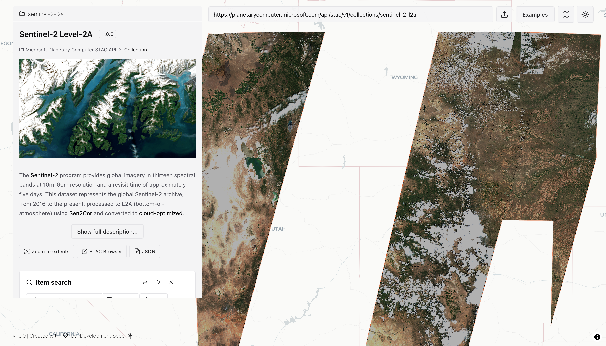

# stac-map

[](https://github.com/developmentseed/stac-map/actions/workflows/ci.yaml)
[](https://github.com/developmentseed/stac-map/deployments/github-pages)
[](https://github.com/developmentseed/stac-map/releases)

The map-first, single-page, statically-hosted STAC visualizer at <https://developmentseed.org/stac-map>.

Includes:

- Client-side COG rendering via [deck.gl-raster](https://github.com/developmentseed/deck.gl-raster)
- Render collections via some web map services (see https://github.com/developmentseed/stac-map/issues/314 for which ones we haven't implemented yet)
- [stac-geoparquet](https://github.com/radiantearth/stac-geoparquet-spec) visualization, upload, and export

<!-- markdownlint-disable MD033 -->
<picture>
  <source media="(prefers-color-scheme: dark)" srcset="img/stac-map-dark.png">
  
</picture>
<!-- markdownlint-enable MD033 -->

## Deploying

There's two ways to deploy your own version of **stac-map**:

- [Build-time configuration](#build-time-configuration)
- [React component](#react-component)

### Build-time configuration

If you only need to customize a few things (default href or auth), you can simply clone this repository and configure the app with environment variables.
See [deploy.yaml](./.github/workflows/deploy.yaml) for a (drop-dead simple) example of deploying this application as a static site via Github Pages.
The environment variables are:

| Variable              | Description                        | Default            |
| --------------------- | ---------------------------------- | ------------------ |
| `VITE_BASE_PATH`      | URL path prefix (e.g., `/my-app/`) | `/stac-map/`       |
| `VITE_DEFAULT_HREF`   | STAC resource to load on startup   | None (shows intro) |
| `VITE_AUTH_AUTHORITY` | The OIDC authority to use for auth | None               |
| `VITE_AUTH_CLIENT_ID` | The OIDC client id to use for auth | None               |

Example:

```shell
VITE_BASE_PATH=/ VITE_DEFAULT_HREF=https://my-stac-api.com yarn build
```

Or create a `.env` file:

```shell
VITE_BASE_PATH=/
VITE_DEFAULT_HREF=https://my-stac-api.com
```

Then run `yarn build` and deploy the `dist/` directory to your static hosting provider.

### React component

For more flexible configuration, we provide a `StacMap` React component via [@developmentseed/stac-map](https://www.npmjs.com/package/@developmentseed/stac-map).
To use it:

```javascript
import { StrictMode } from "react";
import { createRoot } from "react-dom/client";
import { StacMap } from "@development-seed/stac-map";

createRoot(document.getElementById("root")!).render(
  <StrictMode>
    <StacMap />
  </StrictMode>
);
```

See [src/main.tsx](./src/main.tsx) for a real-world example of using the component (it's what drives https://developmentseed.org/stac-map).

> [!NOTE]
> We plan to provide JSDocs for all available properties before releasing v2 of **stac-map**

## Development

Get [yarn](https://yarnpkg.com/), then:

```shell
git clone git@github.com:developmentseed/stac-map
cd stac-map
yarn install
yarn dev
```

This will open a development server at <http://localhost:5173/stac-map/>.

We have some code quality checks:

```shell
yarn lint
yarn format
```

And some simple tests:

```shell
yarn playwright install
yarn test
```

## Contributing

We have some [architecture documentation](./docs/architecture.md) to help you get the lay of the land.
We use Github [Pull Requests](https://github.com/developmentseed/stac-map/pulls) to propose changes, and [Issues](https://github.com/developmentseed/stac-map/issues) to report bugs and request features.

We use [release-please](https://github.com/googleapis/release-please) to create [releases](https://github.com/developmentseed/stac-map/releases).
This requires our commit messages to conform to [Conventional Commits](https://www.conventionalcommits.org/en/v1.0.0/).
