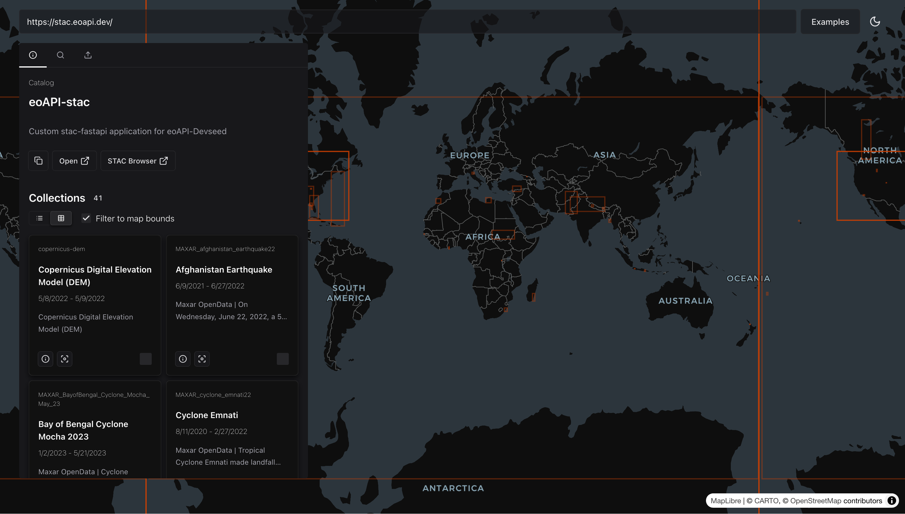

# stac-map

[](https://github.com/developmentseed/stac-map/actions/workflows/ci.yaml)
[](https://github.com/developmentseed/stac-map/actions/workflows/deploy.yaml)

The map-first STAC visualizer at <https://developmentseed.org/stac-map>.



Includes:

- Natural language collection search
- **stac-geoparquet** visualization

> [!WARNING]
> This application is in its infancy :baby: and will change significantly and/or break at any time.

## Development

Get [yarn](https://yarnpkg.com/), then:

```shell
git clone git@github.com:developmentseed/stac-map
cd stac-map
yarn install
yarn dev
```

This will open a development server at <http://localhost:5173/stac-map/>
We have some code quality checks/tools:

```shell
yarn lint
yarn format
```

## Contributing

We use Github [Pull Requests](https://github.com/developmentseed/stac-map/pulls) to propose changes, and [Issues](https://github.com/developmentseed/stac-map/issues) to report bugs and request features.

## Deploying

See [deploy.yaml](./.github/workflows/deploy.yaml) for a (drop-dead simple) example of deploying this application as a static site via Github Pages.
